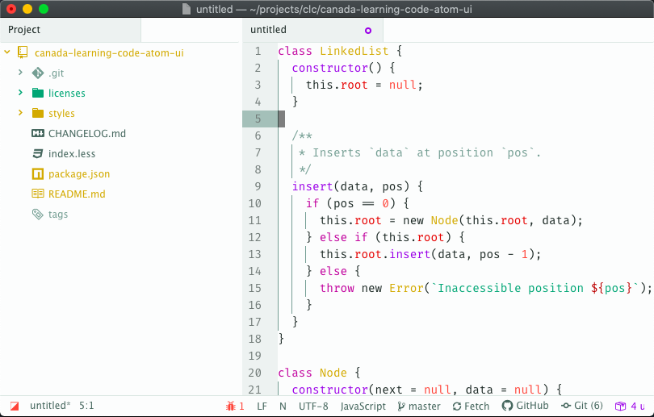

# Canada Learning Code Atom UI Theme

Atom UI scheme based on Canada Learning Code's brand colours

## Colours
Each colour is taken from one of [Canada Learning Code](https://canadalearningcode.ca)'s program brand colours (with the exception of the Canada Learning Code colours, which come from the overall brand itself).

| Colour                                                   | Program                | Hex       |
| -------------------------------------------------------- | ---------------------- | --------- |
|  | Canada Learning Code   | `#d6322d` |
|  | Canada Learning Code   | `#23a39f` |
|  | Ladies Learning Code   | `#b1099a` |
|  | Girls Learning Code    | `#8b31e0` |
|  | Kids Learning Code     | `#00a076` |
|  | Teens Learning Code    | `#ff584e` |
|  | Teachers Learning Code | `#ffce03` |

## Licenses
The colour scheme is licensed [CC BY-NC 4.0](licenses/CC-BY-NC-4.0). The styling files (i.e. the LESS files) are licensed [MIT](licenses/MIT.md).
